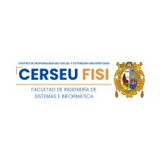

# Especializacion de Python - UNMSM
>(CERSEU - INGENIERÍA DE SISTEMAS E INFORMÁTICA - UNMSM)

### MÓDULO BÁSICO

    *Tipos básicos de datos 📌
    *Operaciones comunes 📌
    *Estructura de datos 📌
    *Práctica: Ejercicos sobre tipo de datos y operadores 📌

    *Entradas y salidas (E/S)📌
    *Operadores de asignación📌
    *Estructura de control de flujo📌
    *Maninpulación de cadenas📌
    *Funciones e introducción a la programación funcional📌

    *Programación orientada a objetos (POO)📌
    *Manejo de excepciones📌
    *Módulos y librerías📌
    *Pip, Virtualenv, pienv📌
    *Uso de so, sys, math, Date, Json📌
    *Expressiones regulares📌

    *Manejo de errores en Python📌
    *Sobre escritura de métodos📌
    *Errores personalizados📌
    *Modelar un objeto en Python📌
    *Manejo de archivos en Python📌
    *Decoradores en Python📌
    *Programación orientada a objetos en Python📌
    *Paquetes y módulos📌
    *Clases y Objetos📌
    *Entorno virtual en Python📌
    *Herencia📌

    *Realizar operaciones usando tipos de datos y operadores📌
    *Controlar flujo de decisiones y bucles📌
    *Realizar operaciones de entrada y salida📌
    *Documentar y estrucuturar código📌
    *Realizar operaciones usando módulos y herramientas📌
    *Realizar resolución de problemas y gestión de errores📌

### MÓDULO INTERMEDIO

	*PEP8 en la práctica📌
	*Acceso a la base de datos (SQLite, SQLserver, PostgreSQL)📌
	*Consumo de Servicios Web📌
	*Introducción a Django📌
	
	*Modelos, Shell y API Queryset📌
	*Vistas y plantillas📌
	*Django Admin📌
	*Usuario y login con Facebook📌
	
	*Formularios y Vistas avanzadas📌
	*Modelos y ORM avanzado📌
	*Integración con múltiples base de datos📌
	*Manejo de imágenes en Django📌
	
	*Integrando con Django Rest Framework (DRF)📌
	*Documenta y organiza una API📌
	*Consumir API con request📌
	*Autenticación y JWT📌
	*Seguridad de API📌
	
	*Cache de vistas y template📌
	*Cache de serialización en DRF📌
	*Integrar Mongo DB en DRF📌

### MÓDULO AVANZADO

#### |PROXIMAMENTE|
